  # Знакомство с Ассемблером (FASM)
  ## Пример №1
Данная программа позволяет создать уведомление опредленного типа (ошибка/предупреждение и т.д.) с текстовой информацией, а также кастомным заголовком.

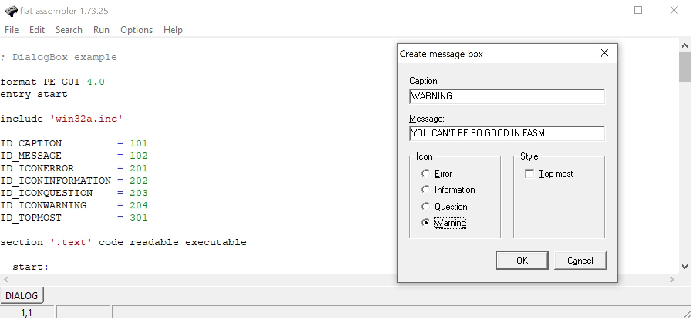​

Результат работы программы:

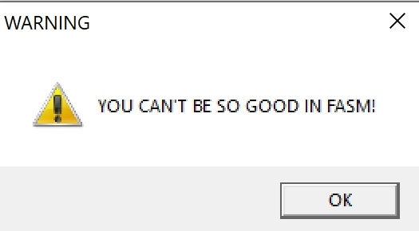​

Немного поиграемся с иходником и увеличим наше меню:

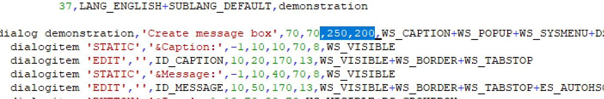​

Немного изменим кнопки:

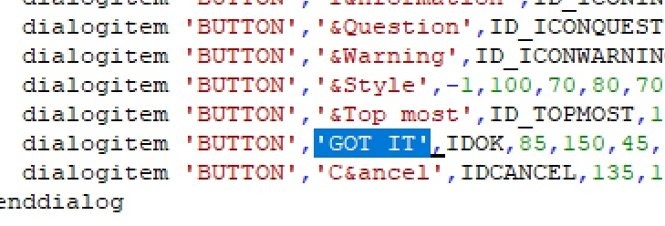​

Результат:

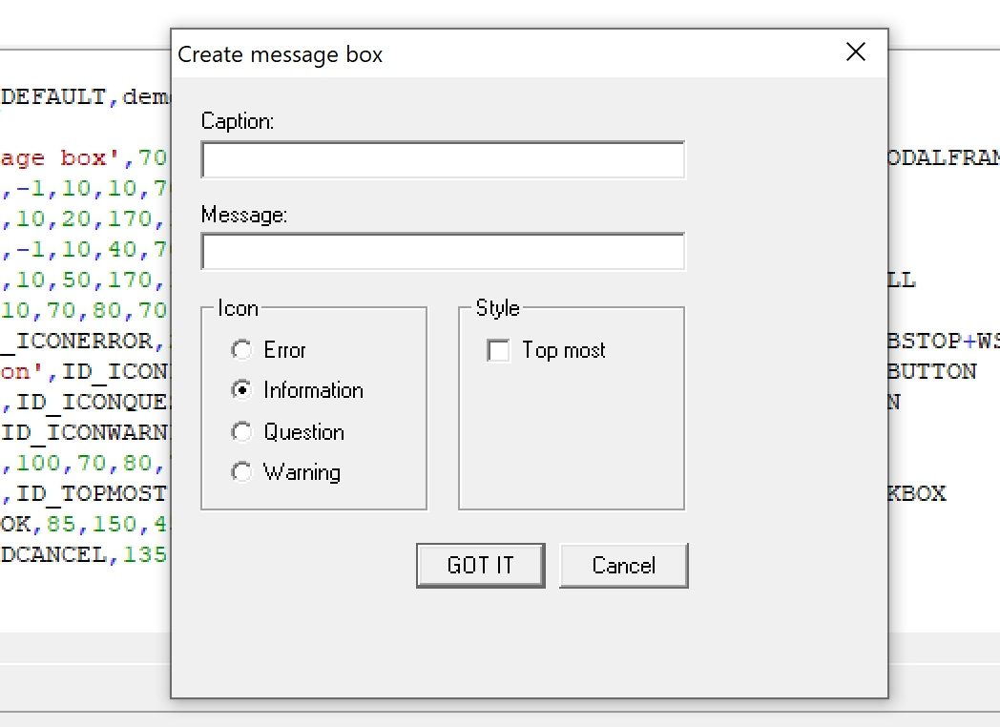​

***
## Пример №2

Программа представляет собой некоторый диалог с пользователем, где имеется возможность ответить утвердительно или отрицательно. В зависимости от ответа сообщение изменится.

 Код программы:
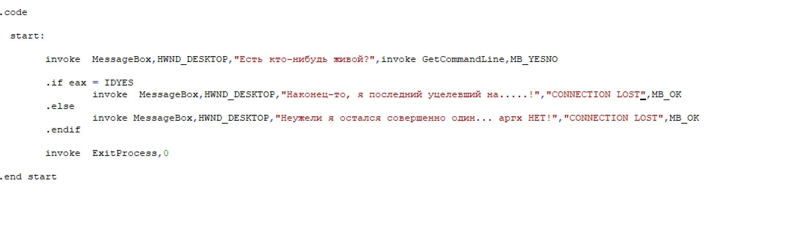​
 Запуск программы

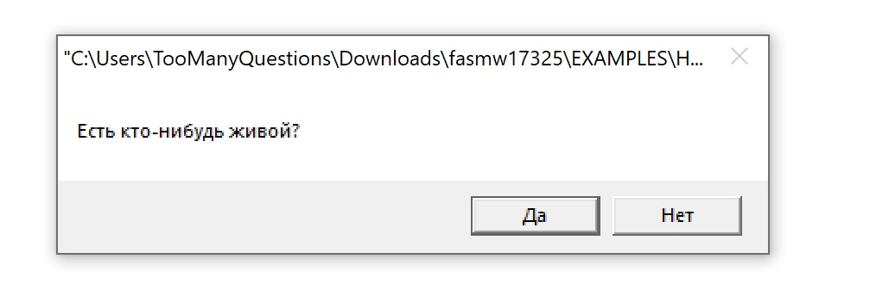​
Результат, если пользователь ответил отрицательно:
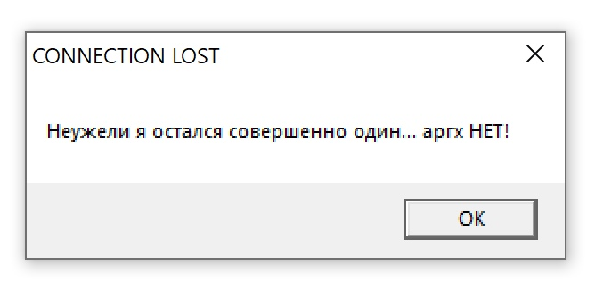​
Результат, если пользователь ответил утвердительно:

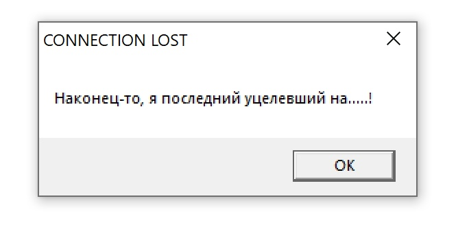​
***
## Пример №3
Программа представляет собой визуализацию вращающегося квадрата. 

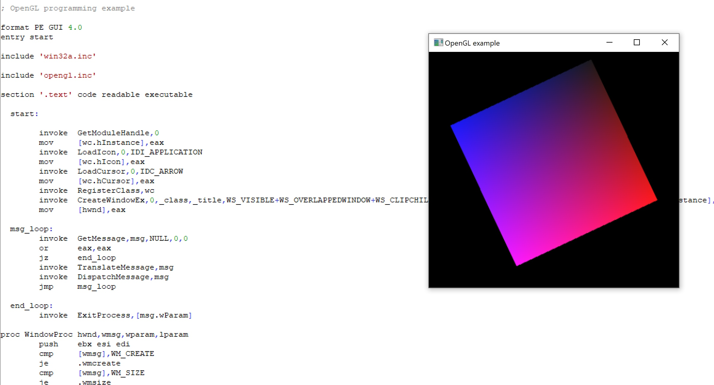​

Немного изеним исходный код, хотим, чтобы цвет градиента был другим

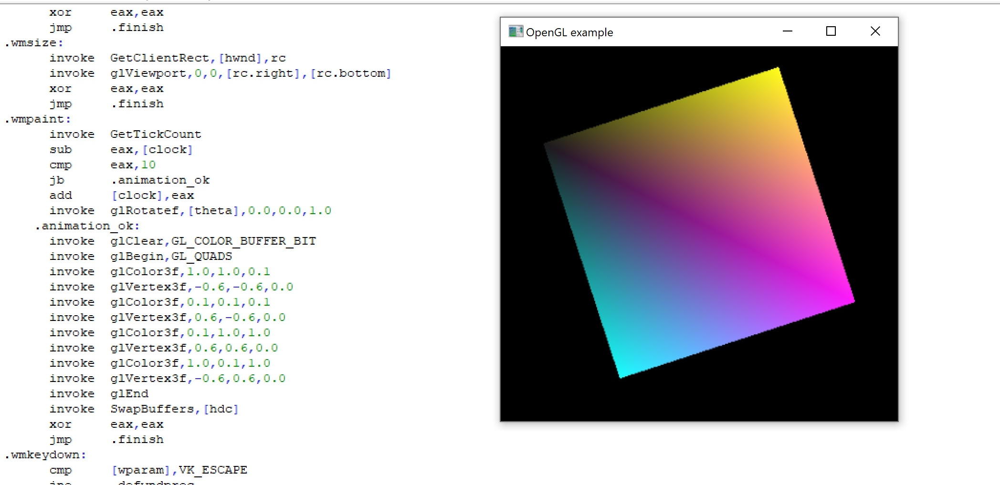​
***
## Пример №4

Основная функция программы - убирать/добавлять иконку приложения на панель управления. Здесь нет входных данных, так что посмотрим на программу в действии и поиграемся с разрешением:

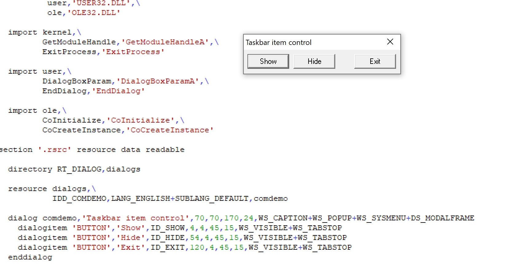​

Изучим код и изменим разрешение окна:

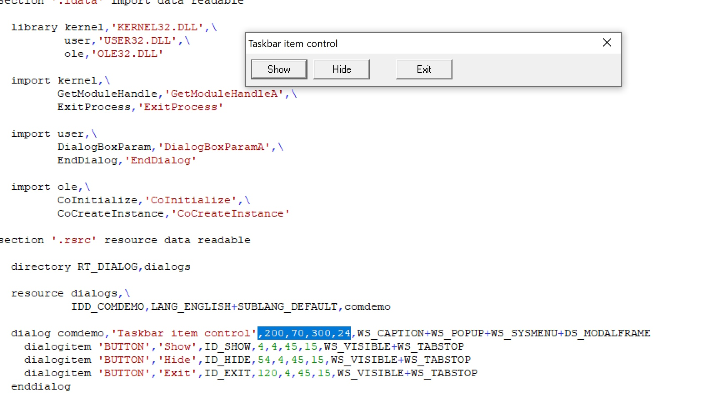​
***

## Пример №5

Напоследок я нашел наиболее интересный вариант из существующих - небольшое приложение для визуализации некоторого тора, которым можно управлять

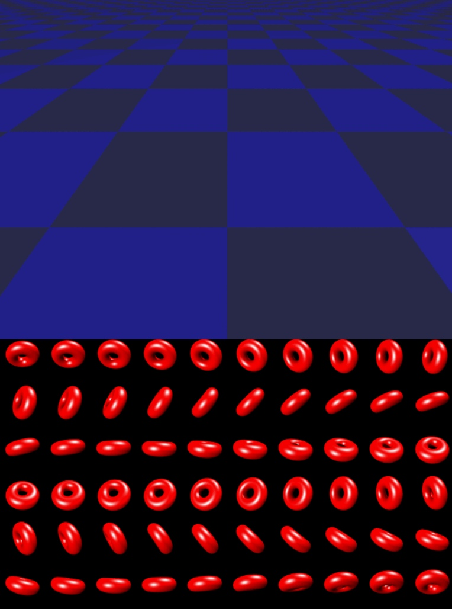​
***
## Источники информации:
* Все образцы и исходные коды программ были взяты из официальной версии FASM (папка EXAMPLES)
* Для подготовки был использован flat assembler (FASM)
