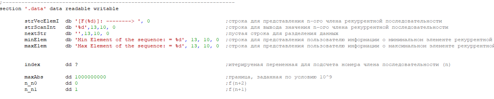
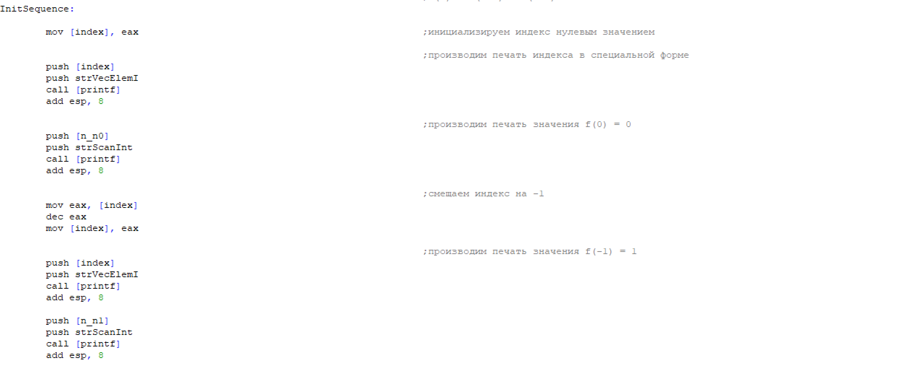
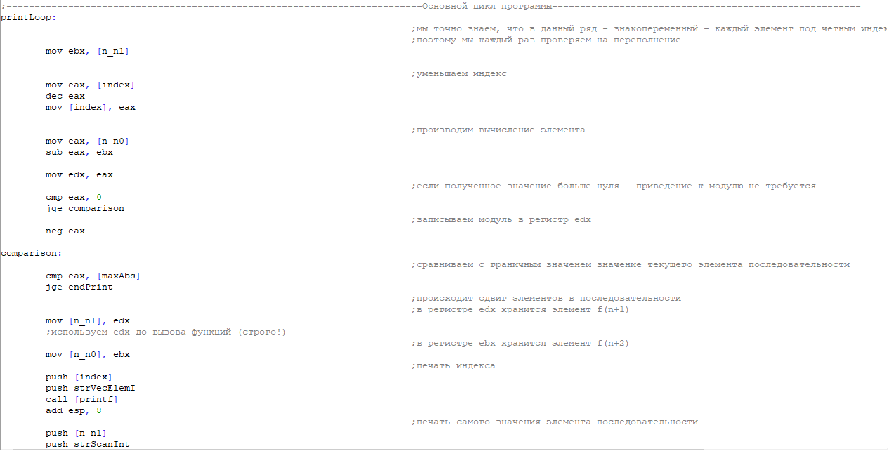
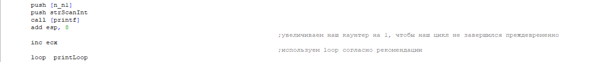
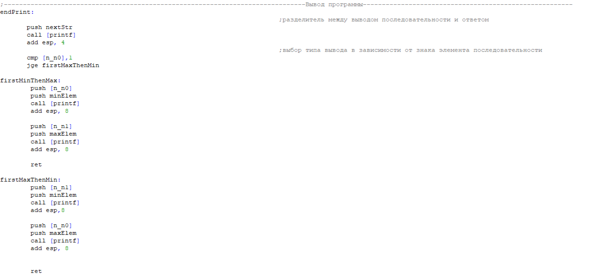
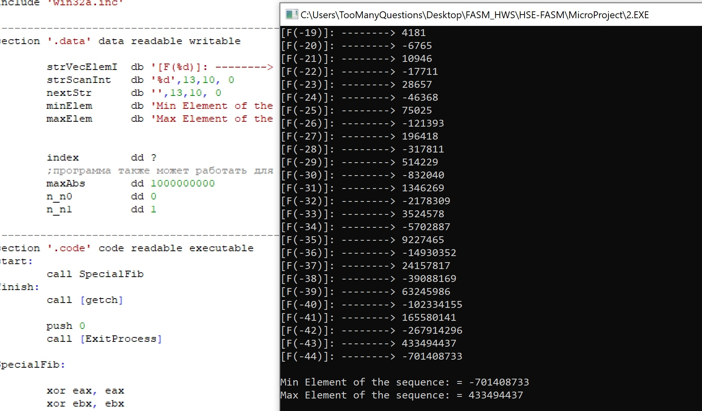
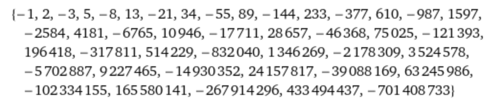

  # **Микропроект №1 (FASM)**
  > ### Подготовил и разработал программу: **студент БПИ 191 Самаренко Андрей Валерьевич**
  ## **Назначение программы**
Программа вычисляет максимальное значение параметра числа линейной рекуррентной последовательности 

**("числа Фибоначчи")** со стартовой последовательностью **[0,1]** в отрицательной области значений, не выходящее за пределы целого со знаком  **= 10^9**
***
## **Описание переменных:**
​
В данном фрагменте программы происходит **инициализация переменных**(сначала строковых, затем целочисленных), описание каждой переменной приведено правее в тексте программы.
Переменная | Тип | Значение | Смысл |
--- | --- | --- | --- |
**strScanInt** | db | '%d' | вывод члена последовательности
**strVecElemI** | db | '[F(%d)]: --------> '| индекс члена последовательности
**strScanInt** | db | '' | перевод строки (разделитель)|
**minElem**    | db |'Min Element of the sequence: = %d'| вывод минимального члена
**maxElem**    |  db |'Max Element of the sequence: = %d'| вывод максимального члена
**index**       | dd |?| хранение порядка последовательности              
**maxAbs**       |dd |1000000000| абсолютная граница значений
**n_n0**         |dd |0 | предыдущий член
**n_n1**         |dd |1| текущий член
***
## **Инициализация цикла:**
​
Здесь происходит вывод стартовой последовательности **[0,1]** согласно условию задачи, инициализируется индекс, который в последствии будет исползован в основном цикле программы.
***
## **Основной цикл программы**

**Алгоритм итерации:**
1.  Уменьшение индекса (смещение позиции)
2.  Вычисление следующего члена последовательности, согласно рекуррентному соотношению
3.  Проверка получившегося значения на переполнение (выход за границу 10^9 по абсолютной величине)
4.  Сдвиг предыдущего и текущего элемента
5.  Вывод текущего полученного элемента на экран
***
## **Процедура вывода ответа**

Элементы последовательности отделяются от результата программы пустой строкой, далее, принимая во внимание, что ряд является знакопеременным достаточно сравнить последний или предпоследний элемент с 1:
*  если предпоследний элемент **отрицательный** - он является локальным минимумом, последний в свою очередь будет положительным и наибольшим - **локальным максимумом**
*  если препдоследний элемент **положительный** - он ялвяется локальным максимумом, тогда последний элемент будет отрицательным и наименьшим - **локальным минимумом**
***
## **Результат работы программы**
1. Результат работы программы согласно всем заданным условиям:
   

Проверим полученный ответ с помощью wolframAlpha.com. Немного изменим нашу последовательность, чтобы wolfram смог ее обработать:

**Вывод:** как мы видим программа отработала верно, следующее значение ряда будет **433494437+701408733 = 1134903170**,  что уже выходит за пределы допустимых значений **=  10^9**

Максимальный и минимальный элемент, очевидно, посчитаны верно.

> **Результаты работы программы на различных границах вы можете посмотреть в папке tests**
***
