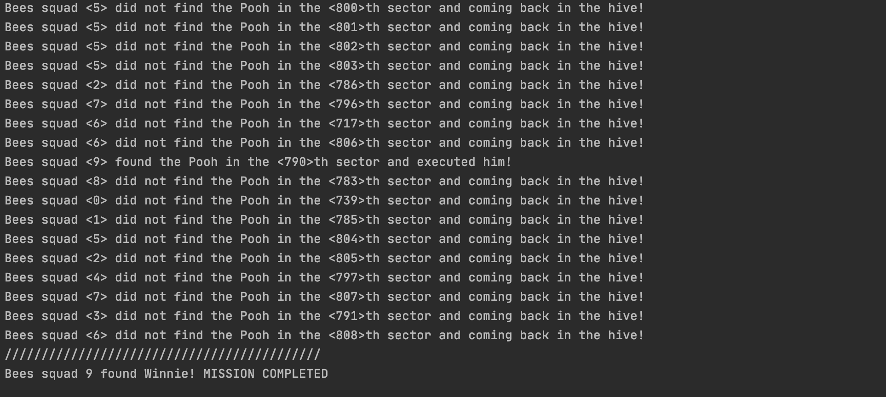

## **Вариант 22**
> **Выполнил:** Самаренко А.В. БПИ191
***
**Для запуска программы:**
```
clang++ -std=c++17 -Xpreprocessor -fopenmp main.cpp -o main -lomp
./main
```
***
### **Описание задачи:**
Первая задача о Винни-Пухе, или неправильные пчелы. Неправильные пчелы, подсчитав в конце месяца убытки от наличия в лесу Винни-Пуха, решили разыскать его и наказать в назидание всем другим любителям сладкого. Для поисков медведя они поделили лес на участки, каждый из которых прочесывает одна стая неправильных пчел. В случае нахождения медведя на своем участке стая проводит показательное наказание и возвращается в улей. Если участок прочесан, а Винни-Пух на
нем не обнаружен, стая также возвращается в улей. Требуется создать многопоточное приложение, моделирующее действия пчел. При решении использовать парадигму портфеля задач.
***
### **Архитектурные решения**
Для решения данной задачи, согласно условию задачи, использовались:
* **OpenMP (открытый стандарт для распараллеливания программ)**
* **Портфельная парадигма многопоточного программирования**
* **Стандартная библиотека C++**
***
### **Код программы**
* # **Инициализация переменных**
  


***
* # **main**
  ### **Процессы:**
1. Установка **seed** для генерации псевдослучайного расположения объекта в массиве
2. Получение от пользователя **количества**:
   1. **Потоков** (отрядов пчел) - [1:10]
   2. **Секций в лесу** - [1:10000]
3. Вычисление **псевдослучайного расположения объекта**
4. Помещение объекта в **псевдослучайный сектор**
5. **Запуск поиска** 
6. Вывод **результатов**
***
  

***

* # **pragma**
  
  ### **Процессы:**
  
1. Вычисление номера потока
2. Поток активен пока объект не найден
3. Поток получает задачу - номер сектора, который необходимо исследовать
4. Поток исследует сектор
5. Если в секторе **находится объект**
     1. Выводится уведомление
     2. Объект больше не разыскивается (уведомление остальным потокам)
     3. Запоминается номер потока, который осуществил поиск объекта успешно
6. Если объекта в секторе **нет**
     1. Выводится уведомление
     2. Цикл повторяется

***
   

***
* # **getArgs**
     ### **Описание:**
     Стандартный метод, предназначенный для получения и обработки входных данных со стороны пользователя. При некорректных входных данных - выводится соответсвующее сообщение, предлагается ввести значение заново.
     ### **Возвращаемое значение:**
     Значение типа int, в промежутке от (0:10000]

     

***
* # **getThreadsNum**
  ### **Описание:**
     Стандартный метод, предназначенный для получения и обработки входных данных со стороны пользователя. При некорректных входных данных - выводится соответсвующее сообщение, предлагается ввести значение заново.
     ### **Возвращаемое значение:**
     Значение типа int, в промежутке от (0:10]

     

 ***
 ### **Использование парадигмы портфеля задач:**
* Определен некоторый массив значений, представляющий собой лес. Ячейка массива - сектор леса. Наличие в секторе объекта обозначается единицей, отсутствие - нулем. 

* Портфель задач представлен переменной типа int - сектор, который необходимо исследовать потоку, который готов к выполнению задачи. Как только поток освобождается от задачи, если объект не найден,  считывает следующий номер ячейки для исследования, при этом переменная увеличивается на единицу - следующая задача необходимая для выполнения обновляется, цикл повторяется до тех пор пока объект не будет найден.

* Как только объект обнаружен, поток, обнаруживший объект уведомляет остальные потоки о находке посредством изменения флага на противоположное значение. Потоки заканчивают свое выполнение.

***
### **Тесты программ:**
* **Проверка входных данных**
  
  

  ***
* **Отработка на небольшом числе - 100**
  
  

  ***
* **Отработка на большом числе - 10000**
  
  

  ***
### **Источники информации:**
* [Параллельное программирование на OpenMP](http://ccfit.nsu.ru/arom/data/openmp.pdf)
* [Многопоточность с OpenMP](http://softcraft.ru/edu/comparch/practice/thread/03-openmp/)
* [Что такое OpenMP?](https://parallel.ru/tech/tech_dev/openmp.html)
***
> Все недочеты выявленые при сдаче предыдущей версии работы выявлены и исправлены:
> * Пользователь может вводить количество потоков
> * Для более успешной отладки была добавлена закомментированная строка sleep(1)