  # **Работа с одномерным массивом (FASM)**
  ## **Назначение программы**
Программа предоставляет пользователю вохможность ввести одномерный массив A[N], затем сформировать из элементов массива A новый массив B по следующему правилу: В массиве B содержатся только элементы массива А, которые не совпадают с первым и последним элементом начального массива.
***
## **Описание переменных:**
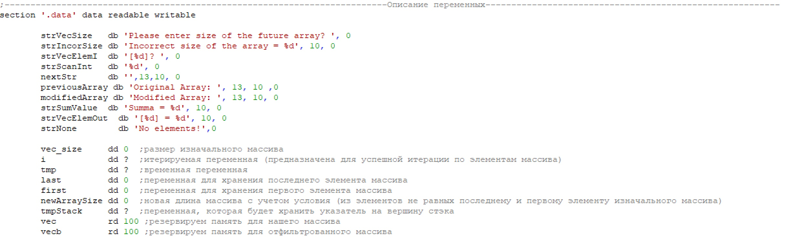​
В данном фрагменте программы происходит инициализация переменных (сначала строковых, затем целочисленных), описание каждой переменной приведено правее.
***
## **Основная часть программы:**
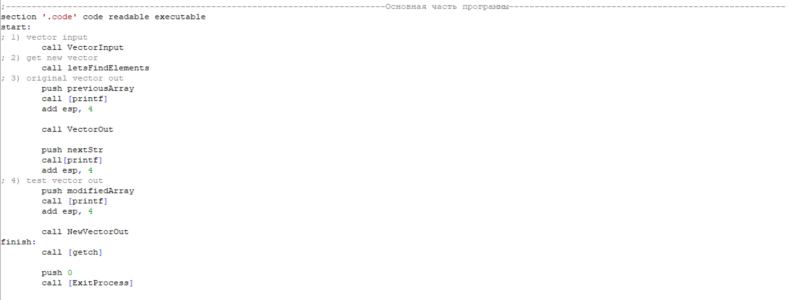​
Здесь происходит вызов основных функций, обеспечивающих работу программы.
* **VectorInput** - ввод вектора
* **letsFindElements** - поиск элементов, не совпадающих с первым и последним элементом оригинального массива
* **VectorOut** - вывод оригинального массива
* **NewVectorOut** - вывод нового массива, согласно условиям задачи
* **finish** - завершение выполнения программы
***
## **Процедура поиска элементов (letsFindElements)**
**Первый элемент** начального массива фиксируется в переменную **first**, в то время как **последний элемент** был зафиксирован в переменной **last** еще при вводе.

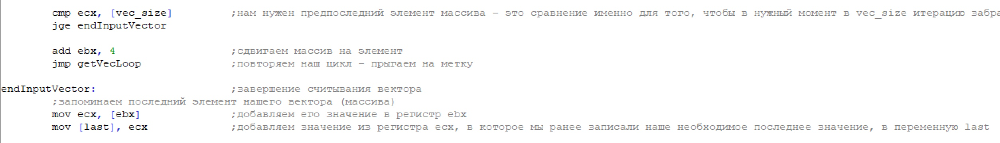

Чтобы отобрать необходимые элементы из начального вектора А, мы проходимся по нему с помощью **цикла**, сравнивая каждый элемент с начальным и последним. Если элемент не равен ни тому, ни другому - он заносится в новый массив **(vecb)**, иначе цикл переходит на следующую итерацию.

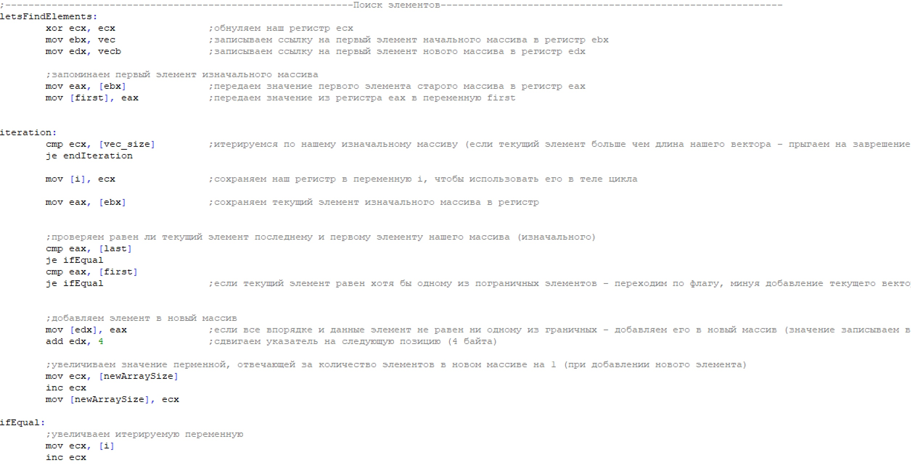​
***
## **Процедура вывода элементов (NewVectorOut)**

**Основная функция данной процедуры** -  вывод элементов новго массива в консоль. Осуществляется данная функция также посредством итерации уже по новому массиву и последовательному выводу каждого элемента в консоль.

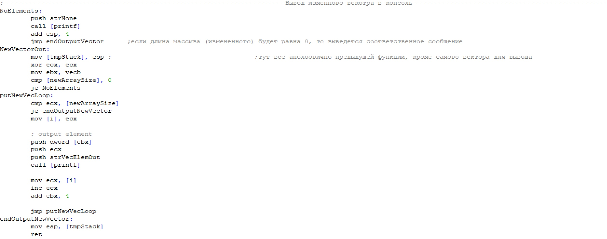​

**Обработка граничных ситуаций:** если массив B из элементов, не совпадающих ни с первым, ни с последним элементом массива A окажется пустым (размер равен 0),  тогда в консоль выведется соответствующее объявление, целью которого является - проинформировать пользователя о том, что массив B является **пустым**.

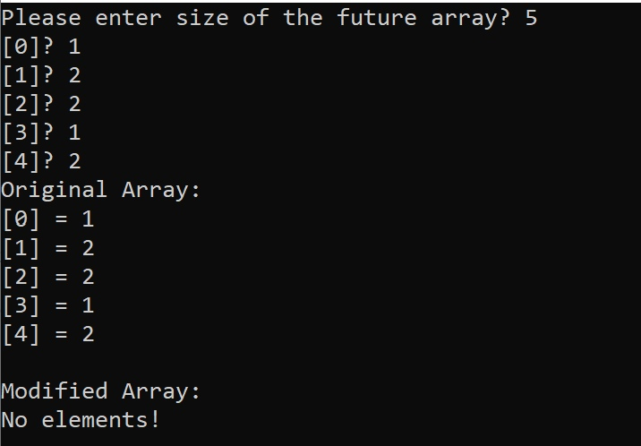​
***
## **Примечания**
Также для удобства отладки и использования программы перед каждым типом массива выводится его тип (**Original** - изначальный массив, который был введен пользователем; **Modified** - массив, составленный согласно условию задачи)

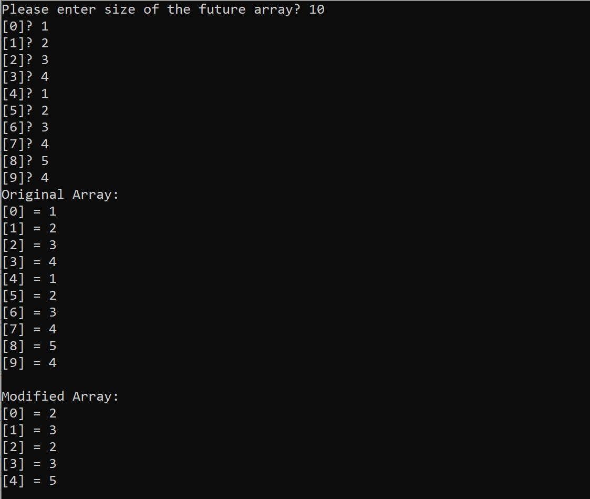​
***
## **Тесты**
* ### **Введем отрицательный разамер массива**
  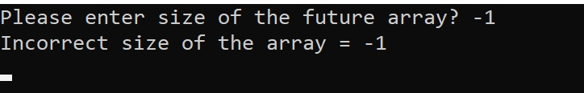​
  Как мы видим - появляется **уведомление об ошибке**, затем программа завершается.

* ### **Попробуем сделать массив B пустым**
  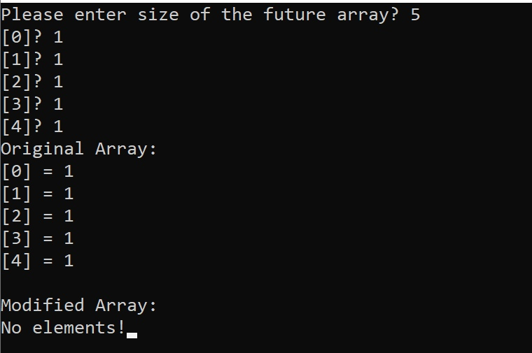​
  Программа отработала **успешно**, появилось уведомление о том, что **массив B пуст**.
* ### **Сделаем так, что в массиве B останется только один элемент**
  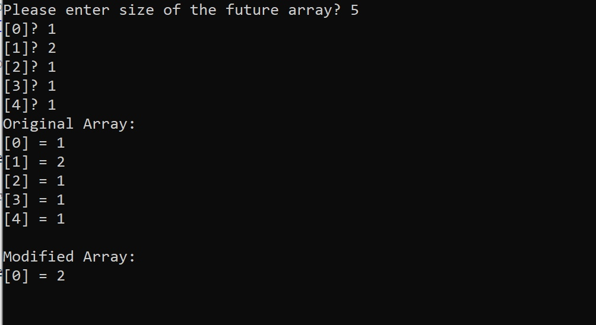​
  Программа отработала в штатном режиме, в массиве только **один** элемент - это **верный ответ**.
* ### **Стандартный тест**
  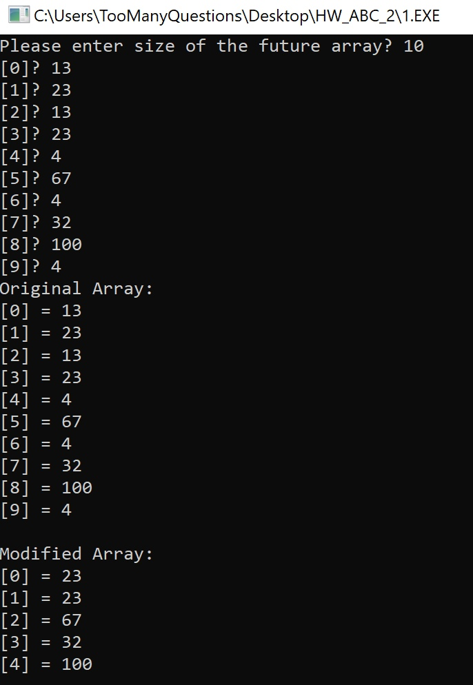​
  Программа отработала в штатном режиме, в массиве, как вы можете самостоятельно убедиться - результат верный.