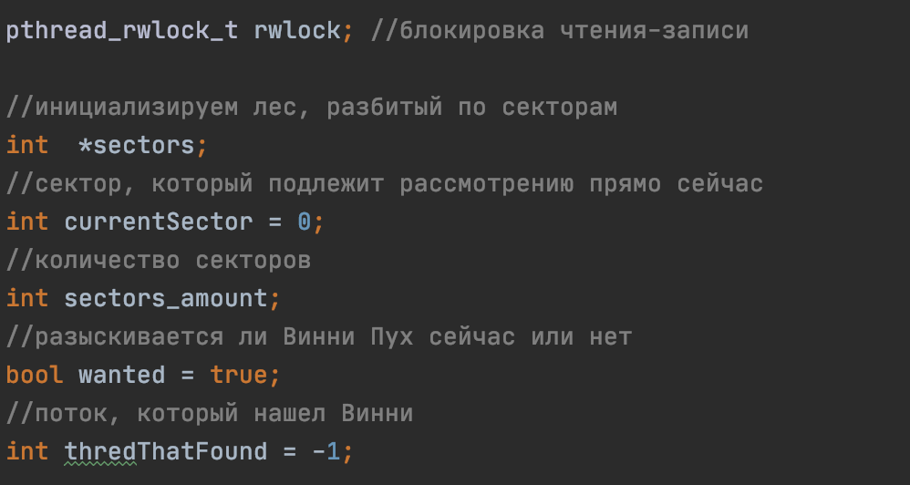
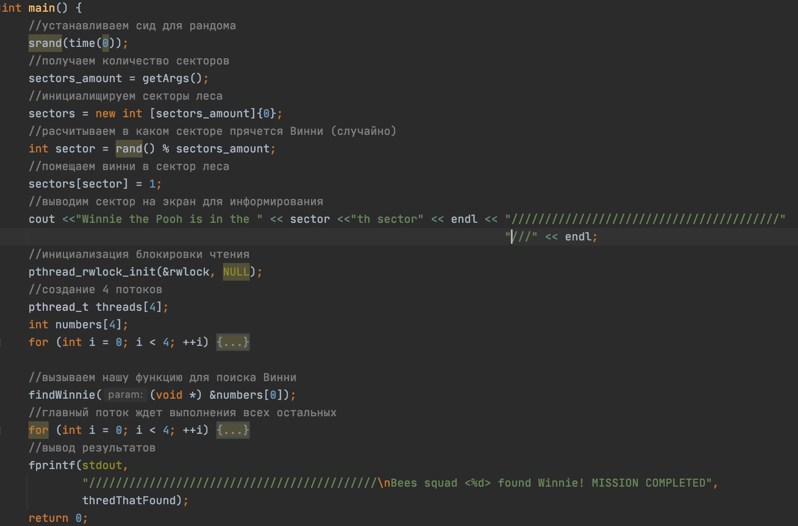
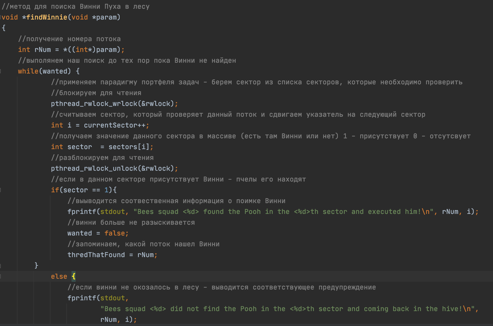
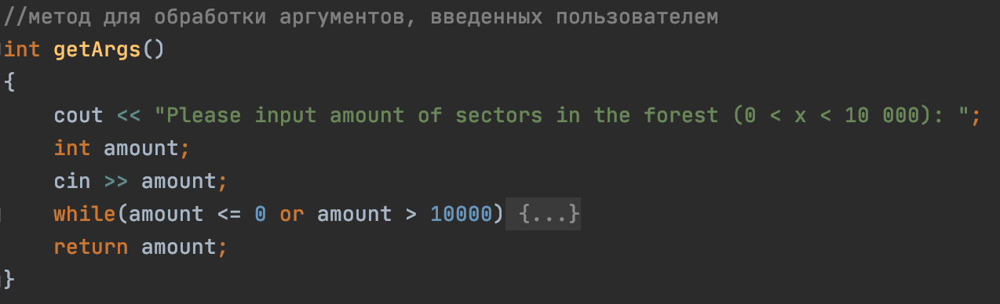
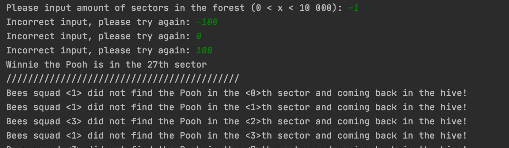
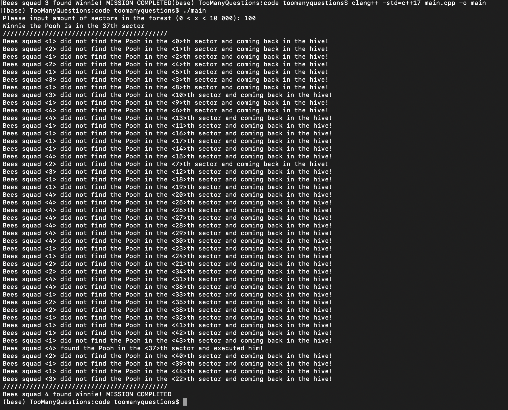
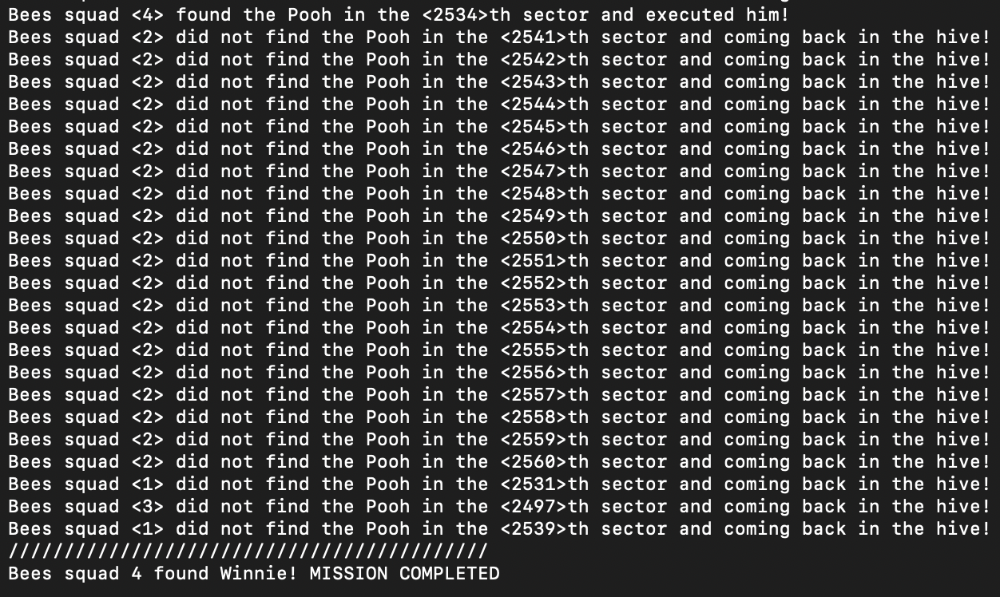

## **Вариант 22**
> **Выполнил:** Самаренко А.В. БПИ191
***
**Для запуска программы:**
```
clang++ -std=c++17 main.cpp -o main
./main
```
***
### **Описание задачи:**
Первая задача о Винни-Пухе, или неправильные пчелы. Неправильные пчелы, подсчитав в конце месяца убытки от наличия в лесу Винни-Пуха, решили разыскать его и наказать в назидание всем другим любителям сладкого. Для поисков медведя они поделили лес на участки, каждый из которых прочесывает одна стая неправильных пчел. В случае нахождения медведя на своем участке стая проводит показательное наказание и возвращается в улей. Если участок прочесан, а Винни-Пух на
нем не обнаружен, стая также возвращается в улей. Требуется создать многопоточное приложение, моделирующее действия пчел. При решении использовать парадигму портфеля задач.
***
### **Архитектурные решения**
Для решения данной задачи, согласно условию задачи, использовались:
* **Портфельная парадигма многопоточного программирования**
* **Стандартная библиотека C++**
* **Использование модуля pthread**
***
### **Код программы**
* **Инициализация переменных**
  
    
***
* **main**
  ### **Процессы:**
 1. Установка **seed** для генерации псевдослучайного расположения объекта в массиве
2. **Чтение аргументов**, передаваемых пользователем
3. Вычисление **псевдослучайного расположения объекта**
4. Помещение объекта в **псевдослучайный сектор**
5. Создание **4 потоков**, моделирующих действие пчел
6. **Запуск поиска**
7. **Соединение потоков** после завершения поиска
8. Вывод **результатов**
   
    
***
* **func**
  ### **Процессы:**
  1. Вычисление номера потока
  2. Поток активен пока объект не найден
  3. Поток получает задачу - номер сектора, который необходимо исследовать
  4. Поток исследует сектор
  5. Если в секторе **находится объект**
     1. Выводится уведомление
     2. Объект больше не разыскивается (уведомление остальным потокам)
     3. Запоминается номер потока, который осуществил поиск объекта успешно
  6. Если объекта в секторе **нет**
     1. Выводится уведомление
     2. Цикл повторяется
   
   

***
* **getArgs**
     ### **Описание:**
     Стандартный метод, предназначенный для получения и обработки входных данных со стороны пользователя. При некорректных входных данных - выводится соответсвующее сообщение, предлагается ввести значение заново.
     ### **Возвращаемое значение:**
     Значение типа int, в промежутке от (0:10000]

     


 ***
 ### **Использование парадигмы портфеля задач:**
* Определен некоторый массив значений, представляющий собой лес. Ячейка массива - сектор леса. Наличие в секторе объекта обозначается единицей, отсутствие - нулем. 

* Портфель задач представлен переменной типа int - сектор, который необходимо исследовать потоку, который готов к выполнению задачи. Как только поток освобождается от задачи, если объект не найден,  считывает следующий номер ячейки для исследования, при этом переменная увеличивается на единицу - следующая задача необходимая для выполнения обновляется, цикл повторяется до тех пор пока объект не будет найден.

* Как только объект обнаружен, поток, обнаруживший объект уведомляет остальные потоки о находке посредством изменения флага на противоположное значение. Потоки заканчивают свое выполнение.

***
### **Тесты программ:**
* **Проверка входных данных**
  
  

  ***
* **Отработка на небольшом числе - 100**
  
  

  ***
* **Отработка на большом числе - 1000**
  
  

  ***
### **Источники информации:**
* [Курс: "Архитектура Вычислительных Систем"](http://softcraft.ru/edu/comparch/practice/thread/01-simple/ "Лекции по многопоточному программированию")
  
* [Парадигма многопточного программирования: "Портфель задач"](https://pro-prof.com/forums/topic/parallel-programming-paradigms "Краткое описание парадигм программирования")
* [Форум по теме: "Многопоточное программирование на C++"](https://www.opennet.ru/docs/RUS/ipcbook/node48.html "Конкретно - синхронизация потоков, метод JOIN")
***
